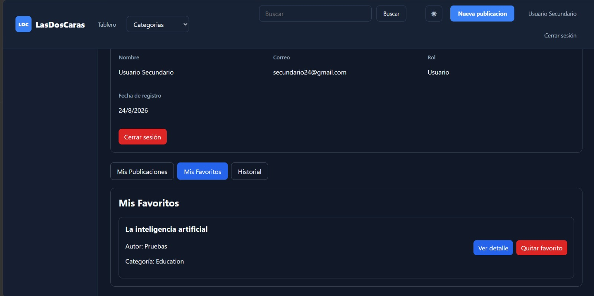
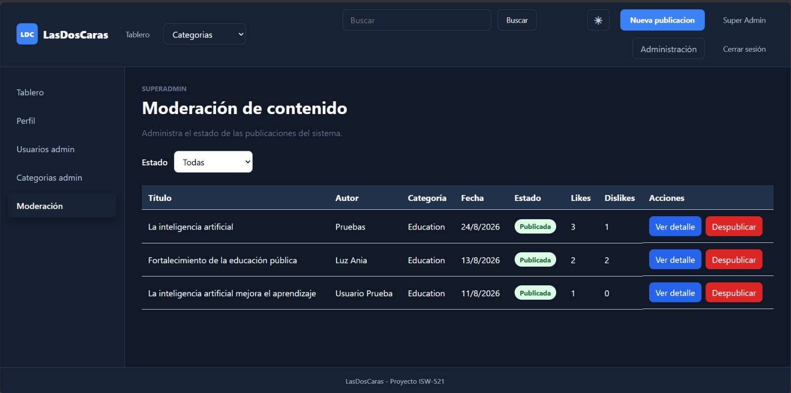
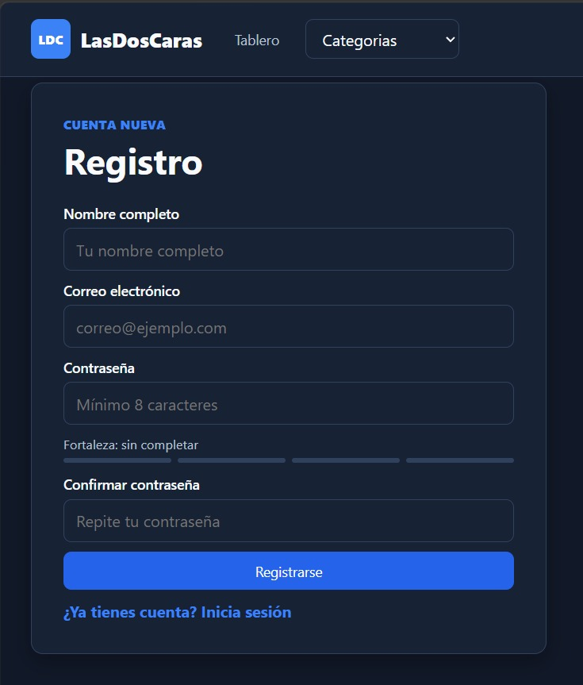
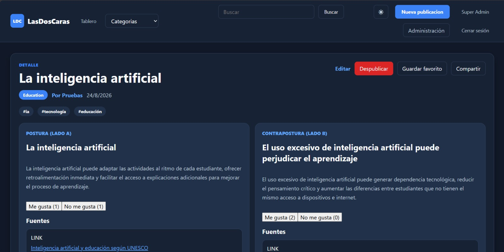
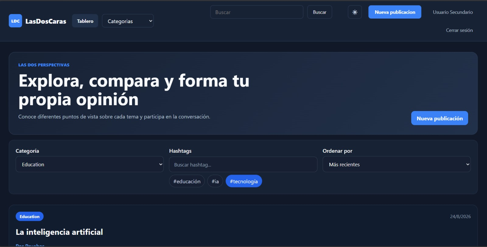
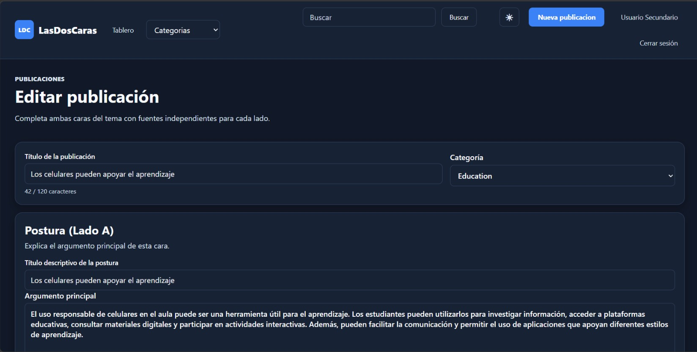
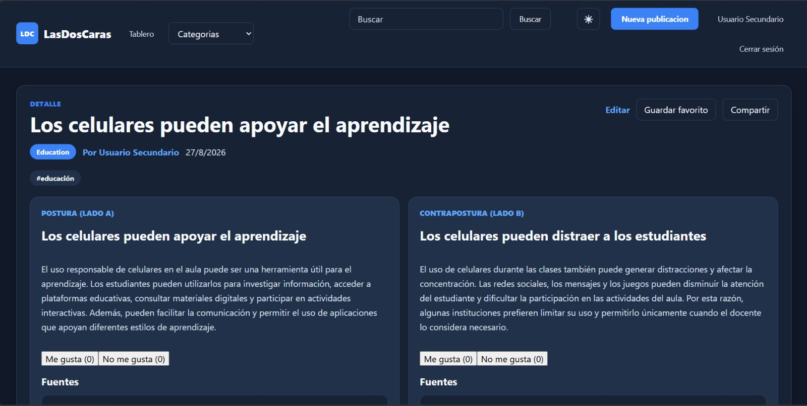

# LasDosCaras

LasDosCaras es una aplicación web de una sola página (SPA) que presenta dos perspectivas opuestas de un mismo tema. Su objetivo es fomentar el pensamiento crítico y el debate informado mediante publicaciones que muestran una postura (Lado A) y una contrapostura (Lado B), cada una con sus propias fuentes y reacciones.

Este repositorio contiene únicamente el **frontend** del proyecto. El REST API utilizado por la aplicación se ejecuta de manera independiente y no forma parte de este repositorio.

## Integrantes

- Daniela Rodríguez
- Shauney Arguello
- Andrea Salazar

## Tecnologías

- Vue 3
- TypeScript
- Vite
- Pinia
- Vue Router
- Axios
- CSS3

## Funcionalidades principales

- Registro e inicio de sesión con JWT.
- Tablero paginado con filtros y búsqueda global.
- Publicaciones con postura y contrapostura independientes.
- Reacciones independientes para el Lado A y el Lado B.
- Creación y edición de publicaciones con fuentes y hashtags.
- Hilos de comentarios, favoritos y perfiles de usuario.
- Historial local de publicaciones visitadas.
- Panel de superadministración para usuarios, categorías y moderación.
- Tema claro y oscuro.
- Manejo centralizado de errores, notificaciones y conectividad.
- Funcionamiento de solo lectura con información almacenada cuando el API no está disponible.

## Requisitos previos

- Node.js y npm instalados.
- El REST API de LasDosCaras ejecutándose de forma independiente.

## Instalación

1. Clonar el repositorio:

```bash
git clone https://github.com/ShauneyArguello/LasDosCaras.git
```

2. Entrar en la carpeta del frontend:

```bash
cd LasDosCaras/frontend
```

3. Instalar las dependencias:

```bash
npm install
```

4. Crear el archivo `.env` tomando como referencia `.env.example`:

```env
VITE_API_URL=http://localhost:3000
```

La URL debe ajustarse si el API se ejecuta en otra dirección o puerto. El archivo `.env` no debe subirse al repositorio.

## Ejecución

Desde la carpeta `frontend`, iniciar el entorno de desarrollo:

```bash
npm run dev
```

Vite mostrará la dirección local de la aplicación, normalmente `http://localhost:5173`.

Para comprobar los tipos de TypeScript y generar la versión de producción:

```bash
npm run build
```

Para visualizar la versión compilada:

```bash
npm run preview
```

## Variables de entorno

| Variable | Descripción | Ejemplo |
| --- | --- | --- |
| `VITE_API_URL` | URL base del REST API | `http://localhost:3000` |

El repositorio incluye `frontend/.env.example`. No se deben guardar contraseñas, tokens JWT ni valores secretos en Git.

## Rutas principales

| Ruta | Pantalla | Acceso |
| --- | --- | --- |
| `/board` | Tablero principal | Público |
| `/login` | Inicio de sesión | No autenticados |
| `/register` | Registro | No autenticados |
| `/categories/:id` | Página de categoría | Público |
| `/views/:id` | Detalle de publicación | Público |
| `/views/new` | Crear publicación | Autenticado |
| `/views/:id/edit` | Editar publicación | Autor o superadmin |
| `/profile` | Perfil del usuario | Autenticado |
| `/authors/:id` | Perfil público de autor | Público |
| `/search?q=` | Resultados de búsqueda | Público |
| `/admin/users` | Gestión de usuarios | Superadmin |
| `/admin/categories` | Gestión de categorías | Superadmin |
| `/admin/moderation` | Moderación de publicaciones | Superadmin |
| `/403` | Acceso denegado | Público |

Las direcciones inexistentes muestran una página personalizada de error 404.

## Caché y localStorage

La aplicación utiliza un `CacheService` centralizado. Su finalidad es restaurar la sesión y mostrar información guardada cuando el API no está disponible.

| Clave | Información almacenada |
| --- | --- |
| `lasdoscaras_auth` | Token JWT y datos del usuario autenticado |
| `lasdoscaras_categories` | Categorías disponibles |
| `lasdoscaras_hashtags` | Hashtags disponibles |
| `lasdoscaras_filters` | Últimos filtros utilizados |
| `lasdoscaras_favorites` | Identificadores de favoritos |
| `lasdoscaras_draft` | Borrador de publicación |
| `lasdoscaras_theme` | Tema claro u oscuro |
| `lasdoscaras_history` | Últimas 20 publicaciones visitadas |

Las contraseñas nunca se almacenan en `localStorage`. Al cerrar sesión o recibir una respuesta HTTP 401 se elimina la información de autenticación.

## Manejo de errores y conectividad

- Las solicitudes al API están centralizadas en la capa de servicios.
- Axios agrega el JWT a las solicitudes autenticadas.
- Se manejan los errores HTTP 400, 401, 403, 404, 409, 422 y 500.
- Las solicitudes GET pueden reintentarse después de un error de red.
- Se muestra un banner cuando no existe conexión con el servidor.
- Las acciones de escritura se bloquean cuando el API no está disponible.
- Al recuperar la conexión se solicitan datos actualizados.

## Estructura del frontend

```text
frontend/
├── public/
├── src/
│   ├── assets/
│   ├── components/
│   ├── composables/
│   ├── models/
│   ├── router/
│   ├── services/
│   ├── stores/
│   ├── views/
│   ├── App.vue
│   ├── main.ts
│   └── style.css
├── .env.example
├── package.json
└── vite.config.ts
```

## Flujo de trabajo con Git

- `main`: versión estable.
- `develop`: rama de integración.
- `feature/*`: ramas de funcionalidades y correcciones.
- Los cambios se integran mediante Pull Requests.
- Los commits usan convenciones como `feat:`, `fix:`, `docs:`, `refactor:` y `style:`.

# Capturas de pantalla

## Captura 1


## Captura 2


## Captura 3


## Captura 4


## Captura 5


## Captura 6


## Captura 7

